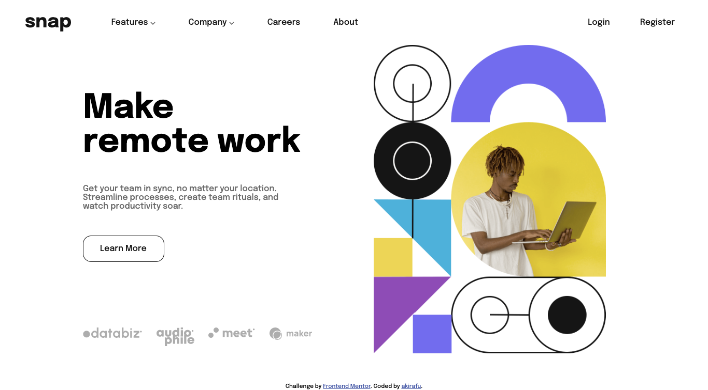
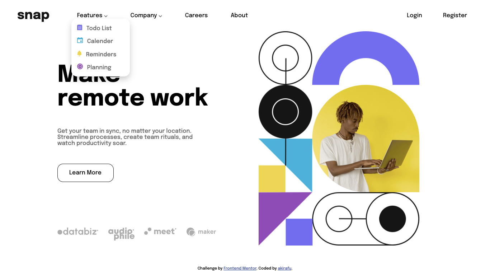

# Frontend Mentor - Intro section with dropdown navigation solution

This is a solution to the [Intro section with dropdown navigation challenge on Frontend Mentor](https://www.frontendmentor.io/challenges/intro-section-with-dropdown-navigation-ryaPetHE5). Frontend Mentor challenges help you improve your coding skills by building realistic projects.

## Table of contents

-   [Overview](#overview)
    -   [The challenge](#the-challenge)
    -   [Screenshot](#screenshot)
    -   [Links](#links)
-   [My process](#my-process)
    -   [Built with](#built-with)
    -   [What I learned](#what-i-learned)
    -   [Continued development](#continued-development)
    -   [Useful resources](#useful-resources)
-   [Author](#author)

## Overview

### The challenge

Users should be able to:

-   View the relevant dropdown menus on desktop and mobile when interacting with the navigation links
-   View the optimal layout for the content depending on their device's screen size
-   See hover states for all interactive elements on the page

### Screenshot





### Links

-   Solution URL: [https://github.com/akiraafu/intro-section-with-dropdown-navigation]
-   Live Site URL: [https://htmlpreview.github.io/?https://github.com/akiraafu/intro-section-with-dropdown-navigation/blob/122a773e0524e07e3f512b08833475bbd4339ea7/index.html]

## My process

### Built with

-   Semantic HTML5 markup
-   CSS custom properties
-   Flexbox
-   CSS Grid
-   Media Queries
-   JavaScript DOM

### What I learned

```css
.proud-of-these-css {
    .user a:nth-child(2) {
        border: 1px solid hsl(0, 0%, 8%);
        border-radius: 1rem;
    }

    .mobileImg {
        display: block;
        justify-content: center;
        transform: scale(1.6);
        margin-top: 10rem;
    }
}
```

```js
const proudOfThisFunc = () => {
    hamburger.addEventListener("click", () => {
        // nav.style.right === "-70%";
        nav.style.right = "0";
        closeBtn.style.display = "block";
    });
};
```

### Continued development

-   Sidebar Dropdown menu
-   The transparent dark color at the left of Sidebar

### Useful resources

-   [MDN](https://developer.mozilla.org/en-US/)
-   [W3Schools](https://www.w3schools.com/)

## Author

-   Website - [Akira](https://github.com/akiraafu)
-   Frontend Mentor - [@akiraafu](https://www.frontendmentor.io/profile/akiraafu)
